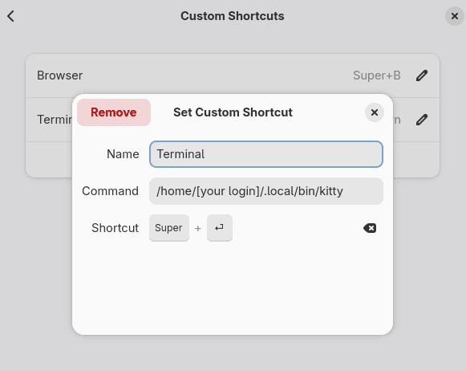

# dotfiles

My config for the 42 piscine. Includes configs for `neovim`, `kitty`, `zsh` (oh-my-zsh) and `git`.

## Usage

```bash
git clone git@github.com:444nt000/dotfiles.git ~/dotfiles
cd ~/dotfiles && ./install.sh
```

> [!WARNING]
> `install.sh` removes `~/.zshrc`, `~/.bashrc` and `~/.config/nvim` before creating the symlinks. Back them up first if needed.

> [!IMPORTANT]
> Set your own name and email in `~/dotfiles/zsh/.zshrc` and `~/dotfiles/git/config`.
> The git config signs commits with `~/.ssh/id_ed25519.pub`: use your own key name or remove `signingkey` and `gpgsign`.

To launch kitty binary with a keyboard shortcut:
*system settings > keyboard > view and customize shortcuts > custom shortcuts*:

<p align="center">
  
</p>

## Cool stuff

* `.c` files are formatted to the norm automatically on save
* `space h`: insert the 42 header
* `space ff` / `space fg`: search files / content in the project
* `-`: file explorer, edit the directory tree like text
* `ctrl ,`: floating terminal
* `gd`: go to definition (clangd)
* Git aliases `co` `br` `ci` `st`, rebase on pull

